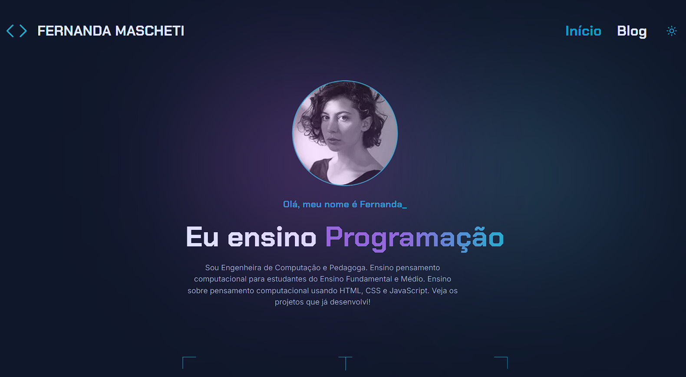

# Portfolio Next.js

> Um portfólio pessoal moderno e responsivo



## 📖 Sobre o Projeto

Este é um site de portfólio moderno que permite exibir projetos de forma elegante e interativa. O projeto foi desenvolvido utilizando as mais recentes tecnologias do ecossistema React/Next.js, com foco em performance, acessibilidade e experiência do usuário.

## ✨ Funcionalidades

- **🎨 Design moderno e responsivo**: Layout que se adapta perfeitamente a todos os dispositivos
- **🌓 Modo escuro**: Alternância entre temas claro e escuro para melhor experiência
- **🔍 Busca e filtros**: Sistema de pesquisa por palavras-chave e filtros por categoria
- **⚡ SEO**: Com meta tags, html semântica e renderização no servidor, este site é otimizado para mecanismos de busca

## �️ Tecnologias

### **Framework & Core**

- [**Next.js 15**](https://nextjs.org/)
- [**React 18+**](https://reactjs.org/)
- [**TypeScript**](https://www.typescriptlang.org/)

### **Estilização & UI**

- [**Tailwind CSS v4**](https://tailwindcss.com/)
- [**Next Themes**](https://github.com/pacocoursey/next-themes)
- [**Lucide Icons**](https://lucide.dev/)

### **Qualidade de Código**

- [**ESLint**](https://eslint.org/)
- [**Prettier**](https://prettier.io/)
- [**Husky**](https://typicode.github.io/husky/)
- [**Lint-Staged**](https://github.com/okonet/lint-staged)

## 🚀 Configurando o setup local

### **Pré-requisitos**

- Node.js 18+
- npm, yarn, pnpm ou bun

### **Instalação**

1. **Clone o repositório**

```bash
git clone https://github.com/Henrique018/next-portfolio.git
cd next-portfolio
```

2. **Instale as dependências**

```bash
npm install
# ou
yarn install
# ou
pnpm install
```

3. **Configure as variáveis de ambiente**

```bash
# Copie o arquivo de exemplo
cp .env.example .env

# Ou crie manualmente o arquivo .env
# e configure as variáveis conforme necessário
```

4. **Execute o servidor**

```bash
npm run dev
# ou
yarn dev
# ou
pnpm dev
# ou
bun dev
```

5. **Abra o projeto**

   Acesse [http://localhost:3000](http://localhost:3000) no seu navegador.

---

## 📁 Estrutura do Projeto

```
📦 next-portfolio
├── 📁 src/
│   ├── 📁 app/              # Next.js App Router
│   │   ├── 📁 blog/         # Páginas do blog
│   │   ├── layout.tsx       # Layout principal
│   │   └── page.tsx         # Página inicial
│   ├── 📁 components/       # Componentes React reutilizáveis
│   │   ├── 📁 ui/           # Componentes de UI base
│   │   └── ...
│   ├── 📁 config/           # Configurações do site
│   ├── 📁 lib/              # Utilitários e helpers
│   └── 📁 services/         # APIs e serviços
├── 📁 public/               # Assets estáticos
└── 📄 package.json
```
